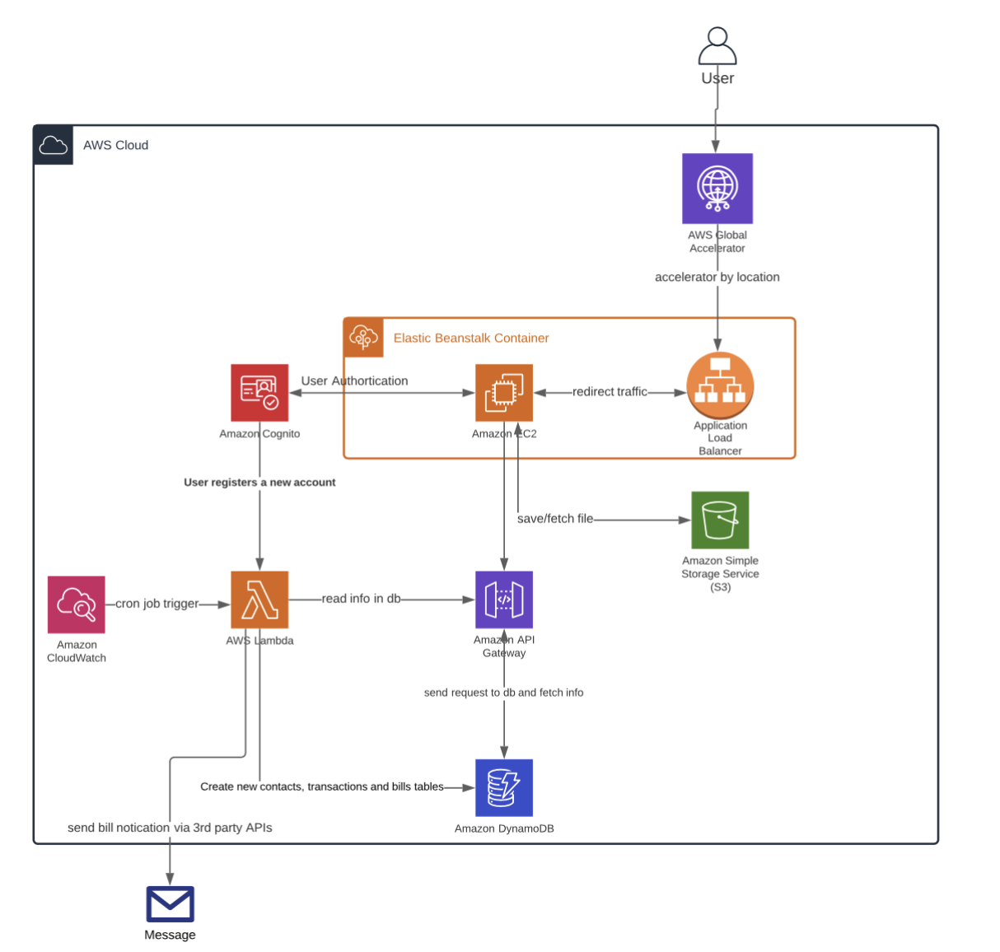

This is a [Next.js](https://nextjs.org/) project deployed on AWS using different types of services provided by Amazon.


## System Design/Architecture



## Getting Started

First, run the development server:

```bash
npm run dev
# or
yarn dev
```

Open [http://localhost:3000](http://localhost:3000) with your browser to see the result.


## Main Functions
1. Login/Register, using Cognito for authentication
2. Income/Expense Record, using DynamoDB, S3
4. Billing Record (file uploading), using DynamoDB, S3
5. Billing Reminder, using external text message API
6. Recoding Bill payments
8. User Data Display


